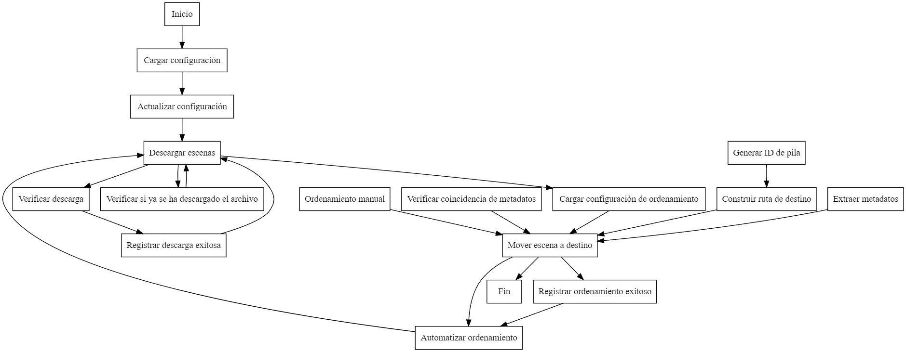

**RESUMEN**

- *descargas.md*: Contiene un reporte técnico del desarrollo de los requerimientos para la descarga de los productos SAOCOM.
- *ordenamiento.md*: Contiene un reporte técnico del desarrollo de los requerimientos para el ordenamiento de los productos SAOCOM.

- *ftp_descargas.py*: Script para la descarga de productos SAOCOM.
- *ftp_ordenamiento.py*: Script para el ordenamiento de los productos SAOCOM.
- *ftp_completo.py*: Codigo con los Scripts anteriores, se completan las funciones. (Estado en desarrollo)

**Diagrama de Flujo**
- Descarga y Ordenamiento de Productos SAOCOM: 